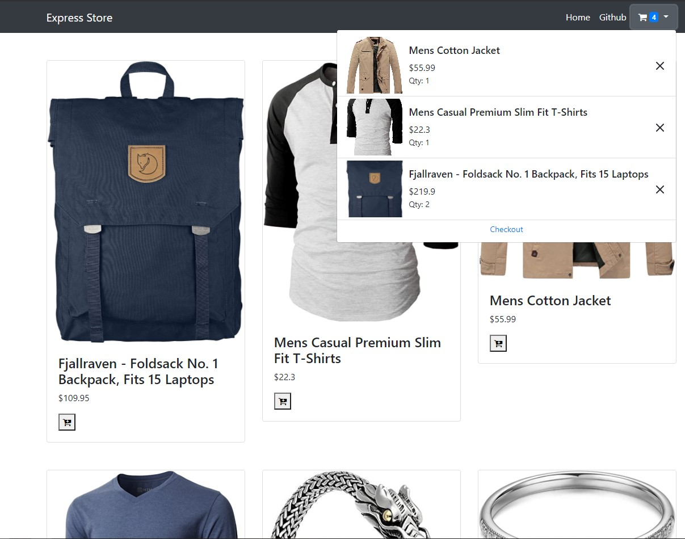
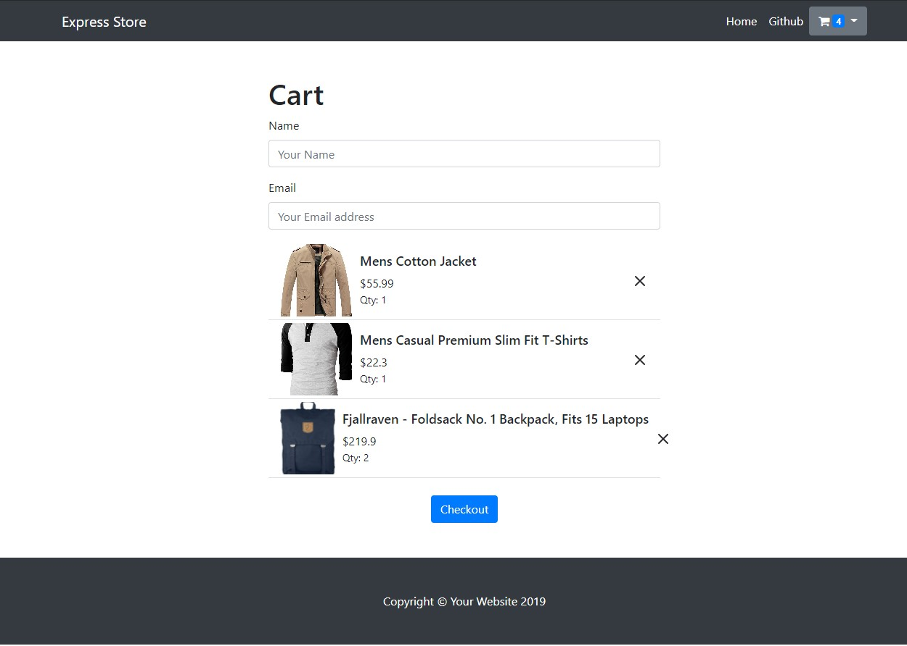
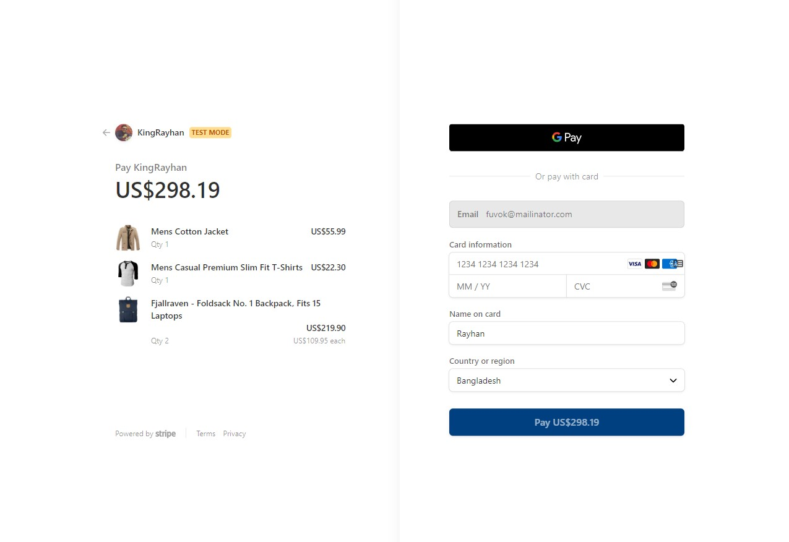

# stripe-checkout

A basic ecommerce application for playaround with stripe in nodejs

### Tools

- Backend: [Expressjs](https://expressjs.org)
- Template Engine: [Edge from adonisjs](https://github.com/ecrmnn/express-edge)
- Frontend Build-tool: [Parceljs](https://parceljs.org/)
- State Management: [@reduxjs/toolkit](https://redux-toolkit.js.org/)
- Products Data: https://fakestoreapi.com/

### Screenshots

